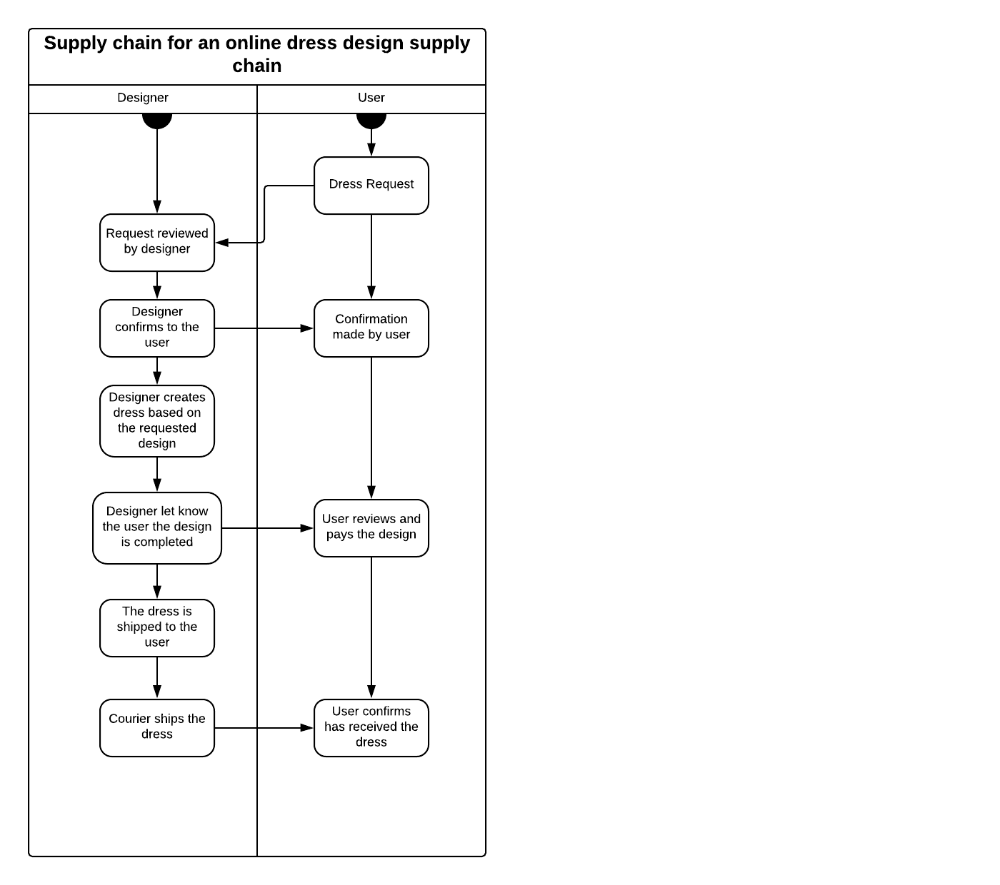
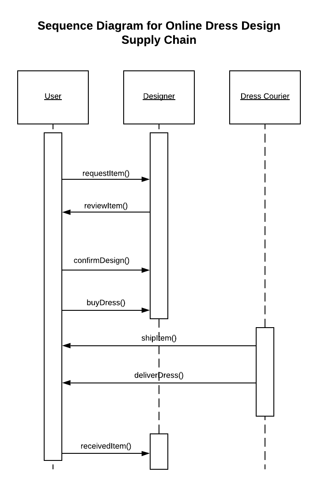
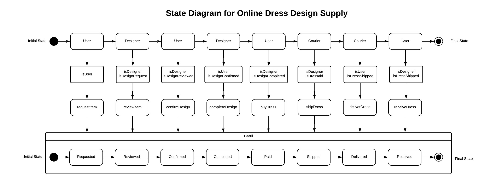
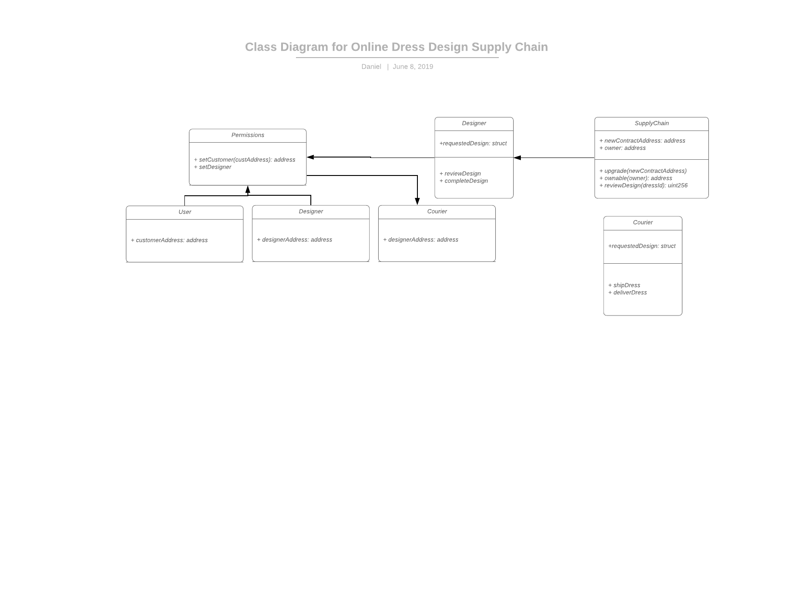

# Ethereum-Dapp-for-Tracking-Items-through-Supply-Chain
Ethereum Dapp for dress design supply chain, this contract allows the creation of a dress design requested by a given user, and handled and owned by various actors at differents stages of the process

# Actors
* User
* Designer
* Courier

# Events
* Requested
* Reviewed
* Confirmed
* Paid
* Shipped
* Delivered
* Received

# UML Diagrams

## Activity Diagram

## Sequence Diagram

## State Diagram

## Class Diagram

