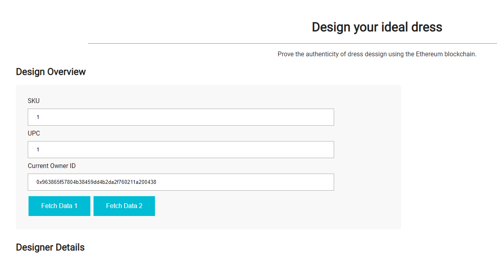
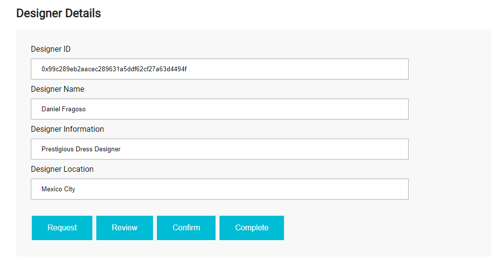
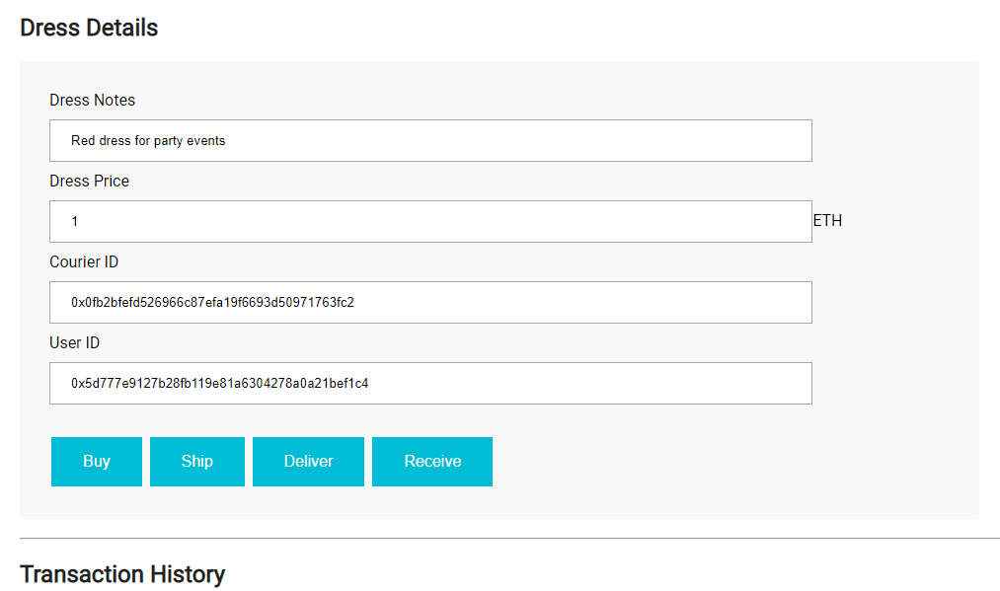
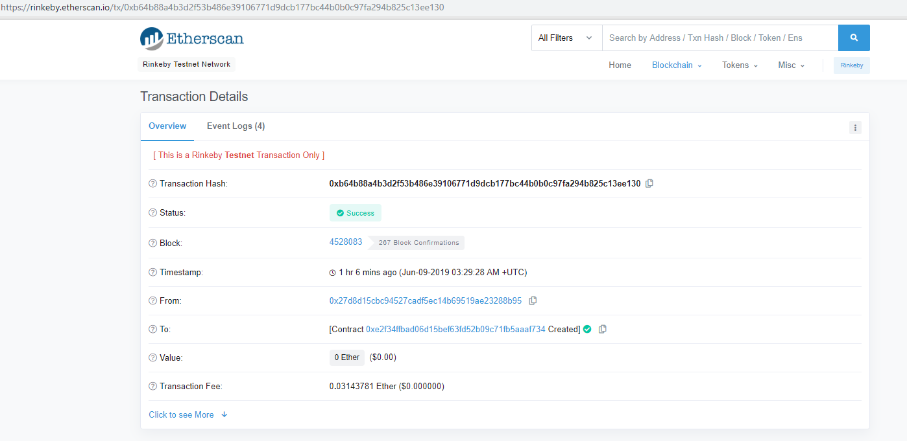

# Ethereum-Dapp-for-Tracking-Items-through-Supply-Chain
Ethereum Dapp for dress design supply chain, this contract allows the creation of a dress design requested by a given user, and handled and owned by various actors at differents stages of the process

# Actors
* User
* Designer
* Courier

# Events
* Requested
* Reviewed
* Confirmed
* Paid
* Shipped
* Delivered
* Received

# Frameworks and technologies used
* Ethereum
* Rinkeby Network
* Solidity 5
* Ganache CLI
* Truffle
* OpenZeppelin
* Mocha JS
* NodeJS

# Installation
### Install packages
```
npm install
```

### Run ganache
```
ganache-cli -m "spirit supply whale amount human item harsh scare congress discover talent hamster"
```

### Compile contracts
```
truffle compile
```

### Test contracts
```
truffle migrate
```

### Migrate contracts
```
truffle migrate
```

### Run UI
```
npm run dev
```

# Screenshoots






# Trx Hash and Contract address

Trx Hash
```
0xb64b88a4b3d2f53b486e39106771d9dcb177bc44b0b0c97fa294b825c13ee130
```

Contract Creator
```
0x27D8D15CbC94527cAdf5eC14B69519aE23288B95
```
Contract Address
```
0xf60d0bdE39256717f275164ADae27cb8836A2c3F
```



# UML Diagrams

## Activity Diagram


## Sequence Diagram


## State Diagram


## Class Diagram


